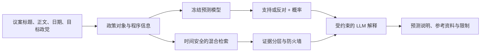

# UK Parliamentary Party Stance Agent

这是一个课程项目，也是一套完整的 AI 产品实验记录。系统根据议案内容、议会角色和近期投票行为，预测英国主要政党对政策对象更可能支持还是反对；随后检索历史投票、竞选纲领和 Bill 背景，生成带有证据边界的解释。

项目没有把最终高分当作唯一结果。仓库保留了标签修正、普通验证失效、2024 年大选后的时间漂移、RAG 误检、LLM 过度断言和证据规则收紧等过程。每次失败都对应一个可以检查的 Notebook。

## 最终结果

最终 MVP 覆盖 Labour、Conservative 和 Liberal Democrat。模型在冻结的 2025 至 2026 年 Test 上取得：

| 指标 | 结果 |
|---|---:|
| Macro-F1 | 0.801 |
| Accuracy | 0.808 |
| ROC-AUC | 0.869 |
| Brier score | 0.170 |
| Rolling-100 Party Prior Macro-F1 | 0.408 |
| 相对基线提升 | 0.393 |

最终模型是两种概率的平均：

```text
支持概率 = 0.5 × Role-only XGBoost 概率
         + 0.5 × 最近 100 次同党投票的支持率
```

XGBoost 学习议会角色、政府背书、议案类型、政策领域和时间等结构规律。Rolling-100 Party Prior 用近期投票补充政党状态变化。RAG 和 LLM 只负责寻找资料和表达结果，不能修改这项预测。

## 系统结构



系统把三件事分开处理：

- 预测层回答“这个党更可能支持还是反对”。
- 证据层回答“过去有哪些真正可比的资料”。
- 表达层把冻结概率和证据写成可读说明，并标明模拟发言不代表政党官方声明。

## 从哪里开始读

- [产品需求文档](UK_Parliamentary_Stance_Agent_PRD.md)：产品目标、用户、功能、范围和验收标准。
- [完整工作记录](UK_Parliamentary_Stance_Agent_Worklog.md)：数据处理、模型选择、失败案例和修改理由。
- [实验索引](EXPERIMENT_INDEX.md)：38 个 Notebook 的顺序、输入、输出和结论。
- [数据说明](DATA.md)：字段、时间切分、知识库来源和 Git 管理方式。
- [结果快照](results/README.md)：最终模型、Agent 评测和图表。

如果只想看最终实现，可先阅读 `09c`、`10`、`11a` 至 `11e` 和 `12`。如果要了解方案为什么变成现在这样，应当从 `01` 开始按编号阅读。

## 快速运行

建议使用 Python 3.10 或 3.11，并从仓库根目录启动 Jupyter。部分 Notebook 会根据当前工作目录寻找数据。

```bash
python -m venv .venv
source .venv/bin/activate
python -m pip install --upgrade pip
pip install -r requirements.txt
jupyter lab
```

基础数据和标签流程：

```text
01_data_audit_and_split.ipynb
02_bill_linkage_and_polarity_review.ipynb
03_finalize_labels_and_build_dataset.ipynb
```

完整复现应按 [实验索引](EXPERIMENT_INDEX.md) 的顺序运行。多数后续 Notebook 依赖前一步生成的 `processed/` 文件。仓库不提交这些可重新生成的中间文件，只保留关键结果快照。

需要 LLM 的单元格默认关闭。只有明确启用付费开关并提供 `OPENAI_API_KEY` 时才会调用 API：

```bash
export OPENAI_API_KEY="your_api_key_here"
```

不要把 `.env`、API Key 或本地缓存提交到 Git。

## 数据与时间切分

原始 `all.csv` 有 18,739 行和 4,372 个 division。最终建模使用 House of Commons 数据，并以 `division_key` 为单位切分：

| 数据集 | 时间 | 用途 |
|---|---|---|
| Train | 2016 至 2023 | 训练模型和建立历史规律 |
| Validation | 2024 | 选择模型、检查大选前后漂移 |
| Test | 2025 至 2026-04-27 | 模型冻结后只运行一次的最终测试 |

一个 division 的多个政党记录始终进入同一个数据集，避免模型在 Train 中见过 Test 议案的相同正文。

## 为什么不能直接把 Aye 当作支持

同样是投 Aye，议员可能是在同意一项政策，也可能是在同意删除某条款。项目先判断 Aye 相对政策对象的方向，再生成支持或反对标签：

```text
归一化政策立场 = 原始投票方向 × motion polarity
```

无法稳定判断的记录进入人工审核或不参与监督学习。完整规则和审核数量见 [工作记录的 polarity 部分](UK_Parliamentary_Stance_Agent_Worklog.md#5-第二阶段为什么必须做-polarity-归一化)。

## RAG 的证据边界

知识库包含历史投票、2024 年政党 Manifesto 和 UK Parliament Bill 背景。检索先用 TF-IDF 和 384 维 Dense Embedding 找候选，再按日期、政策对象、议会程序、政党角色和政府背书关系分层。

| 证据等级 | 用途 |
|---|---|
| Direct historical evidence | 可以解释方向，但仍需说明时间差异 |
| Similar historical vote | 展示类似投票，不能直接证明当前立场 |
| Related policy material | 提供政策背景或相近主张 |
| Legislative background | 解释 Bill、Clause 或程序背景 |
| No external material | 明确说明没有达到展示门槛的资料 |

最终只有 1.2% 的查询拥有最严格的 Direct evidence，23.9% 有可展示的外部材料。这个结果说明，很多新议案没有完全相同的历史先例。产品仍可给出模型概率，但不会把相似材料写成确定证据。

## 仓库结构

```text
.
├── 01_...ipynb 至 12_...ipynb    # 全部实验和调试迭代
├── build_*.py                    # Notebook 生成脚本
├── data/raw/bill_info.csv        # UK Parliament Bill 基础信息
├── rag_sources/                  # Manifesto 等官方资料
├── results/                      # 关键结果快照
├── scripts/validate_notebooks.py # 不执行模型的静态检查
├── UK_Parliamentary_Stance_Agent_PRD.md
├── UK_Parliamentary_Stance_Agent_Worklog.md
├── EXPERIMENT_INDEX.md
├── DATA.md
└── requirements.txt
```

## 已知范围

- 当前产品只覆盖 Labour、Conservative 和 Liberal Democrat。
- Liberal Democrat 的最终 Macro-F1 为 0.456，作为较小反对党实验结果展示。
- 角色映射按 2024-07-05 后的英国议会环境冻结。发生大选或政府更替后，需要更新角色并重新做时间验证。
- Agent 输出是模型分析和 AI 模拟表达，不是政党的正式声明，也不预测单个议员行为。
- 原始数据和官方文档各有自己的来源与使用条件。发布或再利用前请检查对应来源说明。

## 静态检查

下面的命令只检查 Notebook JSON、代码单元语法、文件命名和 Markdown 链接，不训练模型，也不调用 API：

```bash
python scripts/validate_notebooks.py
```

最终数字、失败实验和人工审核过程均记录在 [完整工作记录](UK_Parliamentary_Stance_Agent_Worklog.md) 中。
