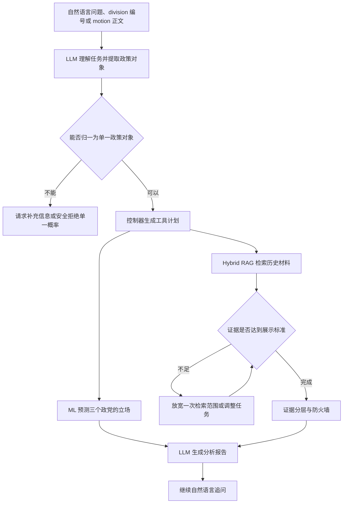

# UK Parliamentary Party Stance Agent

用户可以用自然语言提交一项议案分析任务。系统先识别政策对象和议会程序，再调用预测模型和 RAG，检查材料是否足够，最后生成带有证据边界的解释和模拟党派发言。

仓库保留了标签修正、普通验证失效、2024 年大选后的时间漂移、RAG 误检、LLM 过度断言和证据规则收紧等过程。每次失败都对应一个可以检查的 Notebook。

## 最终结果

最终 MVP 覆盖 Labour、Conservative 和 Liberal Democrat。模型在冻结的 2025 至 2026 年 Test 上取得：

| 指标 | 结果 |
|---|---:|
| Macro-F1 | 0.801 |
| Accuracy | 0.808 |
| ROC-AUC | 0.869 |
| Brier score | 0.170 |
| Rolling-100 Party Prior Macro-F1 | 0.408 |
| 相对基线提升 | 0.393 |

最终模型是两种概率的平均：

```text
支持概率 = 0.5 × Role-only XGBoost 概率
         + 0.5 × 最近 100 次同党投票的支持率
```

XGBoost 学习议会角色、政府背书、议案类型、政策领域和时间等结构规律。Rolling-100 Party Prior 用近期投票补充政党状态变化。RAG 和 LLM 只负责寻找资料和表达结果，不能修改这项预测。

## 系统结构



系统把几项职责分开处理：

- LLM 理解用户要分析什么，并提出需要的工具和信息。
- 控制器检查政策对象、原文引文、多议题风险和工具清单。
- 预测层回答“这个党更可能支持还是反对”。
- 证据层回答“过去有哪些真正可比的资料”。
- 报告层把冻结概率和证据写成可读说明，并标明模拟发言不代表政党官方声明。

聊天框是输入入口，Agent 的核心功能是任务编排。LLM 参与任务理解、工具规划、证据检查和报告生成；预测概率仍由冻结模型计算，最终工具清单由控制器确认。这样既保留了 Agent 的灵活性，也能检查每一步实际调用了什么。

## Agent 如何处理一项任务

用户可以直接问：

> 分析这项法案，各党可能持什么立场？证据是否充分？

系统按下面的顺序处理：

1. LLM 从标题和正文中识别政策对象、motion type、政策领域以及 Aye 的实际含义。
2. 控制器判断文本是否适合进入预测模型。多议题 motion 不会被强行压缩成一个概率。
3. ML 工具分别预测 Labour、Conservative 和 Liberal Democrat 的支持概率。
4. RAG 工具在不知道预测方向的情况下检索历史投票、Manifesto 和 Bill 背景。
5. 系统检查证据的时间、政策对象、程序和政党角色是否可比。
6. 材料不足时，系统只放宽一次检索范围。第二轮结果只能作为相似材料或背景，不能升级成 Direct evidence。
7. LLM 根据冻结概率和通过检查的材料生成报告。用户可以继续追问同一个案例。

`13_unseen_motion_agent_orchestration.ipynb` 记录每一步工具轨迹。它处理了 4 个原数据中没有出现的新 motion，其中 3 个进入预测，1 个多议题案例被安全拦截，共生成 9 条政党预测和 72 条检索材料。

## 用户可以怎样输入

产品输入合同接受自然语言，不要求用户填写 JSON。当前 `13B` 原型先从 `13` 锁定的 4 个未见案例中选择一项，再输入自然语言问题；正式交互入口计划支持下面三种表达：

完整正文：

> 帮我分析下面这项 motion，各党可能如何投票，并模拟议会发言：……

division 链接或编号：

> 分析 `pw-2026-06-02-8-commons`，比较三个政党的立场。

标题加具体问题：

> 分析 Armed Forces Bill New Clause 5。为什么 Labour 可能反对？

如果只有标题而没有足够正文，Agent 应先补充信息：

> 我找到了标题，但缺少完整 motion 正文。请提供正文或公开链接，否则无法可靠判断 Aye 的政策含义。

系统内部会把自然语言转换成结构化任务合同。JSON 用于组件之间传递数据，不是用户输入格式。

## LLM 提示词与输出

规划器使用的核心提示词如下。LLM 负责理解原文，控制器负责检查并落实工具计划：

```text
你是受控 Agent 规划器。只从原文抽取，不预测立场。
多议题且不能归一为单一政策对象时必须阻止预测，
但仍可检索资料并生成限制说明。
```

报告生成器使用的提示词合同如下。Notebook 通过 JSON Schema 固定输出字段，下面这些规则决定内容怎样写：

```text
你是英国议会政策分析 Agent 的报告生成器。

1. frozen_predictions 中的立场和概率已经冻结，不得修改、重算或覆盖。
2. 分开解释 role_model_probability 和 recent_100_prior_probability 如何共同影响最终概率。
3. retrieved_material 只是参考材料；相关背景不能写成直接证明。
4. 只能引用提供的 evidence_id。找不到可靠证据时要明确说明。
5. simulated_spokesperson_statement 是模拟内容，不得写成真实议员原话。
6. 每个政党给出三个完整的 debate points，并解释政策机制或现实影响。
7. 按 speech_length_plan 分配篇幅：high 为 500 至 750 个中文字，medium 为 250 至 400 字，low 为 100 至 200 字。
8. high 发言写 4 至 6 个自然段，medium 写 2 至 4 段，low 写 1 至 2 段；内容包含立场、政策效果、核心论据和必要回应。
9. model_reasoning 解释 Role XGBoost、最近 100 次投票先验与 50/50 融合结果；evidence_interpretation 区分支持材料、挑战材料和普通背景。
10. likely_counterargument 呈现反方最强论证，rebuttal 作出具体回应。
11. 解释 Aye 和 No 对政策对象的实际效果，不能把程序性投票方向说反。
12. 不得读取或猜测新案例的真实投票结果。
```

多轮追问使用另一条受约束提示词：

```text
你是政策分析 Agent 的追问回答器。只能根据冻结报告、冻结预测和给定证据回答。
不得改变概率、预测立场、Aye/No 效果或证据等级。
模拟党派发言必须明确是模拟内容。只能引用允许的 evidence_id。
如果问题超出材料范围，要直接说明无法由现有材料确认。
```

LLM 可以生成：

- motion 的通俗解释，以及 Aye 和 No 的政策效果；
- 三个政党的预测结果、概率和模型原因；
- 对支持材料、挑战材料和普通背景的区分；
- 标明证据 ID 的分析报告；
- 模拟党派发言、三个 debate points、最强反方观点和回应；
- 围绕同一案例的连续追问回答。

党派发言按问题重点分配篇幅。用户明确点名的政党会得到更完整的论证，非重点政党保持简洁。生成内容会标注为 AI 模拟，不代表政党或议员的真实声明。

## 从哪里开始读

- [产品需求文档](docs/PRD.md)：产品目标、用户、功能、范围和验收标准。
- [完整工作记录](docs/WORKLOG.md)：数据处理、模型选择、失败案例和修改理由。
- [实验索引](docs/EXPERIMENT_INDEX.md)：40 个 Notebook 的顺序、输入、输出和结论。
- [Notebook 阅读顺序](notebooks/README.md)：五个实验文件夹的作用和推荐入口。
- [数据说明](docs/DATA.md)：字段、时间切分、知识库来源和 Git 管理方式。
- [结果快照](results/README.md)：最终模型、Agent 评测和图表。

如果只想看最终实现，可先阅读 `09c`、`10`、`11a` 至 `11e`、`12`、`13` 和 `13B`。如果要了解方案为什么变成现在这样，应当从 `01` 开始按编号阅读。

## 快速运行

建议使用 Python 3.10 或 3.11，并从仓库根目录启动 Jupyter。部分 Notebook 会根据当前工作目录寻找数据。

```bash
python -m venv .venv
source .venv/bin/activate
python -m pip install --upgrade pip
pip install -r requirements.txt
jupyter lab
```

基础数据和标签流程：

```text
notebooks/01_data_and_labels/01_data_audit_and_split.ipynb
notebooks/01_data_and_labels/02_bill_linkage_and_polarity_review.ipynb
notebooks/01_data_and_labels/03_finalize_labels_and_build_dataset.ipynb
```

完整复现应按 [实验索引](docs/EXPERIMENT_INDEX.md) 的顺序运行。多数后续 Notebook 依赖前一步生成的 `processed/` 文件。仓库不提交这些可重新生成的中间文件，只保留关键结果快照。

需要 LLM 的单元格默认关闭。只有明确启用付费开关并提供 `OPENAI_API_KEY` 时才会调用 API：

```bash
export OPENAI_API_KEY="your_api_key_here"
```

不要把 `.env`、API Key 或本地缓存提交到 Git。

未见 motion 演示还需要外部 `divisions.parquet`。可以把文件放在 `data/external/divisions.parquet`，或设置路径：

```bash
export DIVISIONS_PARQUET_PATH="/path/to/divisions.parquet"
```

运行顺序：

```text
notebooks/05_final_system/13_unseen_motion_agent_orchestration.ipynb
notebooks/05_final_system/13b_interactive_debate_agent.ipynb
```

13 负责理解新 motion、预测和检索；13B 提供自然语言聊天入口、动态篇幅的模拟党派发言和连续追问。两个 Notebook 的付费开关都可以关闭，先检查免费阶段的结构化输出。

## 数据与时间切分

原始 `data/raw/all.csv` 有 18,739 行和 4,372 个 division。最终建模使用 House of Commons 数据，并以 `division_key` 为单位切分：

| 数据集 | 时间 | 用途 |
|---|---|---|
| Train | 2016 至 2023 | 训练模型和建立历史规律 |
| Validation | 2024 | 选择模型、检查大选前后漂移 |
| Test | 2025 至 2026-04-27 | 模型冻结后只运行一次的最终测试 |

一个 division 的多个政党记录始终进入同一个数据集，避免模型在 Train 中见过 Test 议案的相同正文。

## 为什么不能直接把 Aye 当作支持

同样是投 Aye，议员可能是在同意一项政策，也可能是在同意删除某条款。项目先判断 Aye 相对政策对象的方向，再生成支持或反对标签：

```text
归一化政策立场 = 原始投票方向 × motion polarity
```

无法稳定判断的记录进入人工审核或不参与监督学习。完整规则和审核数量见 [工作记录的 polarity 部分](docs/WORKLOG.md#5-第二阶段为什么必须做-polarity-归一化)。

## RAG 的证据边界

知识库包含历史投票、2024 年政党 Manifesto 和 UK Parliament Bill 背景。检索先用 TF-IDF 和 384 维 Dense Embedding 找候选，再按日期、政策对象、议会程序、政党角色和政府背书关系分层。

| 证据等级 | 用途 |
|---|---|
| Direct historical evidence | 可以解释方向，但仍需说明时间差异 |
| Similar historical vote | 展示类似投票，不能直接证明当前立场 |
| Related policy material | 提供政策背景或相近主张 |
| Legislative background | 解释 Bill、Clause 或程序背景 |
| No external material | 明确说明没有达到展示门槛的资料 |

最终只有 1.2% 的查询拥有最严格的 Direct evidence，23.9% 有可展示的外部材料。这个结果说明，很多新议案没有完全相同的历史先例。产品仍可给出模型概率，但不会把相似材料写成确定证据。

## 仓库结构

```text
.
├── notebooks/
│   ├── 01_data_and_labels/       # 数据审计、Polarity 与最终标签
│   ├── 02_model_development/     # TF-IDF、Hybrid 与时间验证
│   ├── 03_rag_retrieval/         # 知识库、检索和证据精度
│   ├── 04_agent_evaluation/      # 小样本、锁定样本与失败分析
│   └── 05_final_system/          # 最终模型、Test、RAG 和 Agent
├── docs/                         # PRD、Worklog、实验索引和数据说明
├── data/raw/                     # 原始投票与 Bill 数据
├── rag_sources/                  # Manifesto 等官方资料
├── results/                      # 关键结果快照
├── processed/README.md           # 本地生成目录说明
└── requirements.txt
```

真实产品输入演示见 [`13_unseen_motion_agent_orchestration.ipynb`](notebooks/05_final_system/13_unseen_motion_agent_orchestration.ipynb)。它使用外部 Parquet 中 4 个从未进入项目数据的新 motion，并把任务理解、模型预测、证据检索、充分性判断和有限重试组织成可审计的工具流程。[`13b_interactive_debate_agent.ipynb`](notebooks/05_final_system/13b_interactive_debate_agent.ipynb) 在这些冻结结果上增加自然语言聊天、模拟党派发言、debate points、反方观点和回应。

## 已知范围

- 当前产品只覆盖 Labour、Conservative 和 Liberal Democrat。
- Liberal Democrat 的最终 Macro-F1 为 0.456，作为较小反对党实验结果展示。
- 角色映射按 2024-07-05 后的英国议会环境冻结。发生大选或政府更替后，需要更新角色并重新做时间验证。
- Agent 输出是模型分析和 AI 模拟表达，不是政党的正式声明，也不预测单个议员行为。
- 原始数据和官方文档各有自己的来源与使用条件。发布或再利用前请检查对应来源说明。

## 自动检查

GitHub Actions 会递归读取 `notebooks/`，检查 Notebook JSON 和 Python 代码单元语法。检查不会运行训练、读取 API Key 或产生付费调用。

最终数字、失败实验和人工审核过程均记录在 [完整工作记录](docs/WORKLOG.md) 中。
