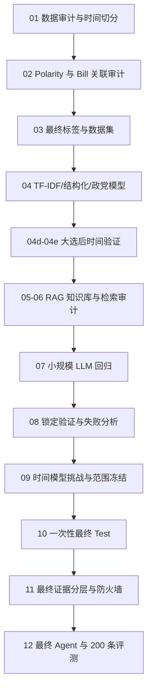

# UK Parliamentary Party Stance Agent：完整工作、思考与迭代记录

> 这份文档记录项目从原始数据到最终Agent的完整过程，包括每一步的理由、失败案例、修改过程，以及最终方案与最初设想的差别。
>
> 面向读者：没有机器学习或 RAG 基础的同学、课程导师、面试官和产品经理。

## 1. 最终结论先说

项目已经完成代码阶段，最终形成了一个三层系统：

1. **预测层**：冻结的 `role_prior_blend_50_50` 模型预测政党对政策对象的支持/反对和概率。
2. **证据层**：RAG 查找历史投票、Manifesto 和 Bill 背景，并将资料分成 Direct、Similar、Related、Background 或无资料。
3. **表达层**：LLM 严格保留模型结果，用通俗语言解释，并引用证据 ID；没有证据时主动兜底。

最终模型在一次性 Test 上取得：

- Macro-F1：0.801；
- Accuracy：0.808；
- ROC-AUC：0.869；
- Brier：0.170；
- 相比 Rolling-100 Party Prior 的 Macro-F1 提升：0.393。

200 条锁定 Agent 评测全部完成，费用约 0.0636 美元。自动评测显示引用有效率和无资料兜底准确率均为 100%，没有触发过度断言代理规则。

项目目前有以下限制：

- Liberal Democrat 的 Macro-F1 为 0.456，没有通过预先设定的 0.50 门槛；
- 只有 1.2% 的查询拥有最严格的 Direct evidence；
- 40 条人工复核中发现 1 条 Direct evidence 分层错误；
- 当前是学生项目 MVP，不是生产级政治决策产品。

## 2. 项目是如何重新定义的

原始课程项目使用结构化字段预测英国政党投票，并用LLM生成文本。这次改造增加了产品范围、证据检索和评测流程：

- 能预测；
- 能给概率；
- 能找到外部资料；
- 能解释“为什么”；
- 能承认证据不足；
- 有可量化评测和 bad case 回归流程；
- 有明确产品边界。

这导致项目的核心问题从“哪个模型分数最高”变成：

> 如何划分预测、证据和自然语言解释的职责，并处理时间变化、标签歧义和资料不足？

## 3. 全流程总览



## 4. 第一阶段：数据审计，而不是立刻建模

### 4.1 我们有什么数据

原始文件 `all.csv` 有：

- 18,739 行；
- 27 个原始字段；
- 4,372 个唯一 division；
- Commons 和 Scotland 两个议会来源；
- 一个 division 对应多个政党，因此每行是“议案 × 政党”。

主要字段包括 motion 标题、motion 正文、日期、motion type、议会总票数和各党票数。

### 4.2 为什么先审计

如果不了解每行代表什么，很容易把同一个议案的四个政党记录随机拆到 Train 和 Test。这样模型在训练时已经看过 Test 议案的正文，最终分数会虚高。

因此使用 `division_key` 做分组和时间切分，确保同一个 division 不会跨数据集出现。

### 4.3 主要发现

- `legislation_id/name/slug` 缺失约 70.72%，不能作为第一版必需特征。
- `party_for_percentage` 缺失约 8.43%。
- 数据没有完全重复行，也没有重复的 `division_key + party` 主键。
- Commons 有 8,948 行、2,091 个 division；Scotland 有 9,791 行。
- Reform 只有 1,251 行，而且主要出现在后期年份。

### 4.4 为什么 Train 一开始只有四个政党

最初切分是：

- Train：2016—2023；
- Validation：2024；
- Test：2025—2026。

切分时先确定时间边界：2016至2023年用于训练，2024年用于开发验证，2025年以后用于最终测试。对应的division比例约为69.5%、9.6%和20.9%，所以它并不是标准的70%/15%/15%比例切分。训练集接近70%只是时间边界产生的结果。

切分单位是 `division_key`。一个division只有一个日期，它对应的四个政党行会随这个日期一起进入Train、Validation或Test。这里不需要再在比例边界处移动四条记录。

移除Reform以后，每个division有四个政党行，因此实际数量是：

| 数据集 | 日期范围 | Division数量 | 政党行数 |
|---|---|---:|---:|
| Train | 2016—2023 | 1,453 | 5,812 |
| Validation | 2024 | 200 | 800 |
| Test | 2025—2026-04-27 | 438 | 1,752 |

日期边界确定后，三个数据集的数量随之确定。这样的切分用于模拟“用过去预测未来”，也让2024年大选前后的变化能够单独检查。

Reform 在较早训练年份中没有对应记录，所以 Train 只有 Conservative、Green、Labour 和 Liberal Democrat。把 Reform 留在 Validation/Test 会形成一个单独的冷启动问题。

MVP 将 Reform 移出研究范围，集中分析拥有连续历史数据的政党。

## 5. 第二阶段：为什么必须做 polarity 归一化

### 5.1 原始标签的问题

一开始可以直接把：

- `party_result = 1` 当支持；
- `party_result = -1` 当反对。

但这实际上只是 Aye/No 的胜负方向。它没有回答“这个党是否支持政策对象”。

例如：

- 动议 A：“通过 Universal Credit 削减”。投 Aye 代表支持削减。
- 动议 B：“撤回 Universal Credit 削减”。投 Aye 代表反对削减。

两条都是 Aye，但政策立场相反。如果混在同一个标签中，执政党、反对党等重要特征会互相抵消。

### 5.2 我们做了什么

从 motion title、motion text、motion type、Clause/Amendment 结构中识别：

- 当前被表决的政策对象是什么；
- Aye 是采纳它、删除它、替换它还是推迟它；
- 因此 Aye 相对政策对象是 `+1` 还是 `-1`。

然后计算归一化政策立场。

这里包含两个任务。polarity规则判断Aye在程序上表示保留、采纳、删除还是否决。06g再抽取用于展示的具体政策对象。06g依次检查人工覆盖、已有人审对象、法规名称、New Clause标题、`bring in a Bill`、`calls on Government`、Bill阶段、`That this House...`主句和motion标题，并保存对应的原文片段 `source_quote`。

程序把 `division_name_clean`、`motion_title_clean` 和 `motion_text_clean` 合并成小写文本，再按固定顺序执行正则规则：

1. **先处理明确的议会Question**：出现 `original words stand part of the question` 或 `proposed words be there added`，记为 `+1 / High`。
2. **先拦截一票多对象**：例如 `leave out ... and insert ...` 同时反对旧文字、支持新文字，不能压成一个方向，记为 `Unknown`，交给人工判断或排除。
3. **处理双重否定**：例如 `not withdraw`、`must not repeal` 实际是在阻止撤回或废除，因此记为 `+1 / High`。
4. **明确否定对象的动作记为 `-1 / High`**：包括 `declines to give second/third reading`、`not be now read`、`leave out`、`not stand part`、`disagree with the Lords`、`revoke`、`annul`、`withdraw`、`reverse`、`repeal`、`abandon`、`reject`、`delete`、`do not approve`。
5. **明确采纳对象的动作记为 `+1 / High`**：包括 `be approved`、`be now read a second/third time`、`clause/schedule stand part`、`agree with the Lords`、`insert`、`add`。
6. **只有motion type、没有明确句式时使用Medium默认值**：`approve_statutory_instrument`、`second_stage`、`third_stage`、`bill_introduction`、`committee_clause`、`add_clause_to_bill`、`proposed_clause` 默认 `+1`；`revoke_statutory_instrument` 和 `reasoned_amendment` 默认 `-1`。
7. 以上都无法判断时记为 `Unknown`，不强行生成标签。

例如，`leave out Clause 89` 的Aye表示赞成删除Clause 89，所以相对于“保留Clause 89”这个对象，polarity是 `-1`；`Clause 89 stand part of the Bill` 的Aye表示保留它，所以是 `+1`。最终用“原始党派投票方向 × polarity”得到该党对政策对象的归一化立场。

### 5.3 High、Medium 和 Unknown 是什么

- High：存在明确的程序词和结构，例如 “leave out clause”“approve regulations”“second reading”。
- Medium：规则可以判断，但语言或程序关系没有 High 那么直接。
- Unknown：动议过长、多议题、程序含糊，规则无法可靠判断。

High、Medium和Unknown描述的是规则可靠度，与预测模型的置信度无关。

规则覆盖全部2,091个Commons divisions，人工审核集中在规则无法稳定判断的记录。最终标签处理结果是：

- 1,126个division由High规则直接保留；
- 167个division经人工审核后保留；
- 96个division经人工审核后标记为不适合监督学习；
- 3个原High案例在抽样质检中改为不适合监督学习；
- 699个division因训练期Unknown/Medium尚未复核、程序性投票或文本不足等原因排除；
- 最终1,293个division可用于监督学习，798个不进入model-ready标签数据。被排除的记录仍保留在原始CSV、审计表和审核记录中，`final_label_eligible=False`，没有从项目文件中删除。

“重要歧义记录”指会直接影响模型选择或最终成绩、同时又缺少可靠自动标签的Validation/Test division。常见情况包括多政策对象、`leave out ... and insert ...`这类双动作、正文截断、纯程序性动议，以及只能根据motion type推断方向的Medium记录。这些记录进入P0、P1和评测集P3队列。Train中尚未审核的540个Unknown和137个Medium不进入监督学习。High规则另抽取50条做质量检查。

资源允许时，可以由两名熟悉英国议会程序的标注者独立判断，计算一致率，再由第三人处理分歧。本项目采用风险分层方案：明确案例由规则处理，Validation/Test歧义项人工审核，High规则抽样质检，尚未审核的Train歧义项不进入监督学习。

### 5.4 P0、P1、P2、P3 的含义

人工队列按风险和使用位置排序：

- P0：马上影响 Validation/Test 或最关键规则，优先检查。
- P1：同样重要但风险略低，优先建立可信评测集。
- P2：主要位于 Train；不检查不会污染最终评测，但会减少训练数据或带来训练噪声。
- P3：更多是低风险、背景或规则扩展案例。

检查的目的不是“把所有 NA 都填满”，而是确保 Validation/Test 的答案可信，并找到规则的系统性错误。

### 5.5 五档标签为什么没有成为最终目标

暂定五档基于归一化后连续得分，将记录分成 strongly oppose、oppose、mixed/neutral、support 和 strongly support。但数据绝大部分集中在 strongly support / strongly oppose，中间档很少，五分类并没有足够可靠的真实标签。

因此最终产品主目标仍然是二分类概率。五档可以作为概率展示方式，但不作为独立训练真值。

## 6. 第三阶段：建立最小可行基线

### 6.1 为什么先用 Logistic Regression + TF-IDF

TF-IDF 会自动从训练文本中建立词和字符片段词表，不是人工先列关键词。Logistic Regression 可以输出概率，训练快，也容易作为文本分类基线。

我们比较了：

- Global prior：先看训练集中“支持”和“反对”哪一类更多，然后对每一条新记录都预测这个多数类。它不看政党、议案文字、日期或政策领域。比如训练集里“支持”更多，它就会把所有议案都预测为支持。这个方法不是正式产品模型，而是一条最低比较线：后续模型至少应该比这种“永远猜多数答案”的办法更好。本项目中它在 Validation 上的 Accuracy 为 0.591，但 Macro-F1 只有 0.372，说明它虽然能靠多数类猜对一部分记录，却几乎不会识别少数类；
- Party prior：只按每个党过去的支持率预测；
- Structured only：只用结构化字段；
- TF-IDF word；
- TF-IDF word + char；
- TF-IDF + structured。

### 6.2 第一个重要失败

Validation 结果：

| 模型 | Accuracy | Macro-F1 | ROC-AUC |
|---|---:|---:|---:|
| Party prior | 0.670 | 0.635 | 0.654 |
| TF-IDF word + char | 0.584 | 0.571 | 0.694 |
| TF-IDF + structured | 0.570 | 0.568 | 0.697 |
| Structured only | 0.567 | 0.566 | 0.689 |
| Global prior | 0.591 | 0.372 | 0.677 |

“更复杂的文本模型”竟然不如简单 Party prior。这说明同一段 motion text 对四个政党完全相同，真正需要学习的是“不同政党如何解释同一个政策”，而不是只识别政策词语。

### 6.3 每党独立分类头

下一步让每个政党有自己的 Logistic Regression 分类器。可以理解为：只保留某一个党的历史支持/反对结果，为这个党训练文本权重；四个党共享同一套 TF-IDF 表示，但各自学习不同决策边界。

结果提升到：

- Macro-F1：0.680；
- Accuracy：0.688；
- ROC-AUC：0.720；
- 最差政党 Macro-F1：0.591。

它确实优于 Party prior，但没有达到当时预先写入 Notebook 的三项开发门槛：Macro-F1 至少 0.72、相对 Party prior 至少提高 0.05、最差政党 Macro-F1 至少 0.60。实际结果分别是 0.680、提高约 0.045、最差政党 0.591，所以三项都差一点。

这些数值是“希望模型有明显提升”的进取标准，不是统计学规定。对当前数据量、标签噪声和2024年政权更替来说，它们偏严格。更合适的报告方式是同时保留两层结论：这个模型已经带来有意义的改进，但没有达到预设的进取门槛。这样既不否认改进，也不在看到结果后改低标准。

### 6.4 混合文本与制度特征

`hybrid_global_party_extended` 同时使用：

- 全局文本规律；
- 各党独立文本规律；
- 政党角色；
- 政府背书；
- motion type；
- policy domain；
- 时间特征。

这些输入不全是新字段。`motion_type` 和议案文本来自原始数据；`party_role`、政府背书、较宽泛的 `motion_family`、政策领域和年月等字段由特征工程生成。全局文本规律和各党文本规律也不是两份原始文本，而是同一段文本的两种数学表示。

具体做法是先把议案文本转换成一行 TF-IDF 数字。全局文本区块对每个政党都启用，用来学习跨党的共同词语规律。随后为每个政党建立一个独立文本区块：当前行为 Labour 时只打开 Labour 区块，其余政党区块全部填 0。最后再把政党角色、政府背书、motion type、policy domain 和时间等结构化数字横向拼在后面。Logistic Regression 一次读取整行，因此既能学习所有政党共享的规律，也能为同一个词学习不同政党的权重。

这些区块都是同一个模型的自变量。训练时，Logistic Regression 为每个数字学习一个权重；预测时，将“特征值 × 权重”全部相加，再加上截距。这个加总结果叫 logit。最后通过 sigmoid 函数把 logit 压到 0 至 1，得到支持概率：

```text
logit = 截距
      + 全局文本特征 × 全局文本权重
      + 当前政党文本特征 × 该党文本权重
      + 制度特征 × 制度特征权重

支持概率 = 1 / (1 + exp(-logit))
```

因此，“全局文本贡献”“当前政党文本贡献”和“制度字段贡献”不是三个模型各投一票。它们先作为自变量进入同一个 Logistic Regression，再由模型学到的权重共同决定概率。某个词出现并不自动加固定分数，具体加多少取决于训练后得到的系数和该条记录的 TF-IDF 数值。

前面的模型不是完全没有这些字段。`Structured only` 只用结构化字段，普通 TF-IDF 只用共享文本，`TF-IDF + structured` 使用共享文本和结构化字段，04B 的获胜模型主要使用各党独立文本。`hybrid_global_party_extended` 的区别是把共享文本、各党文本和扩展制度特征同时放进一个模型。

Validation Macro-F1 提升到 0.723，Accuracy 0.726，最差政党 Macro-F1 0.625，所有普通 Validation gate 都通过。

普通 Validation 已经达到开发目标，但接下来的时间切分显示，这个成绩主要来自大选前记录，不能代表政权更替后的表现。

## 7. 第四阶段：发现“大选后失效”

### 7.1 为什么普通 Validation 误导了我们

把 2024 年 Validation 拆成大选前后后发现：

| 政党 | 大选前 Macro-F1 | 大选后 Macro-F1 |
|---|---:|---:|
| Conservative | 0.856 | 0.542 |
| Labour | 0.897 | 0.325 |
| Liberal Democrat | 0.899 | 0.604 |
| Green | 0.914 | 0.246 |

模型在大选前几乎完美，却在大选后大幅下降。原因是政党角色发生变化：Labour 从主要反对党变为执政党，Conservative 相反。

### 7.2 时间留出验证

我们没有新增一批外部 Validation，而是把原来的2024年 Validation 再按时间拆分。大选后较早的记录作为 adaptation，让模型接触新的执政环境；更晚的记录作为 temporal holdout，用来模拟“只用当时已经发生的投票预测未来”。2025至2026年的最终 Test 仍未读取。

04D 初版按大选后 division 的时间顺序平分，得到31个 adaptation division和32个 temporal holdout division。后来发现2024年11月6日同一天的记录落在边界两侧，04E改为按完整日期切分：2024年7月22日至10月29日作为 adaptation，共23个division；2024年11月6日至12月17日作为 temporal holdout，共40个division。adaptation 已参与训练，只有后半段 temporal holdout 才计算评测成绩。

结果：

- Primary temporal Macro-F1：0.482；
- 最差政党 Macro-F1：0.210；
- recent-weighted 最好也只有 0.515。

这证明问题不是随机噪声，而是制度变化造成的分布漂移。

### 7.3 平滑集成仍然失败

这里实际做了两层更新，原来的“历史模型和近期 Party prior 混合”说得过于简单。

第一层是近期概率平滑。程序先计算大选前的历史支持率，再用 adaptation 中的近期投票更新。近期样本少时，历史概率相当于一批伪样本，防止几条新记录让结果突然跳到 0 或 1。制度概率还会逐级参考政党角色、政府背书、motion family，以及更具体的“政党加角色加议案类型”组合。

第二层是模型集成。主方案按下面的公式平均两个支持概率，而不是直接平均支持/反对标签：

```text
最终支持概率 = 0.5 × Adapted文本模型概率
             + 0.5 × 近期更新后的制度概率
```

例如文本模型给出0.70，制度模型给出0.40，最终概率就是0.55。我们还把25/75和75/25作为敏感性分析，但没有用 temporal holdout 搜索最优权重。最好的单一 recent party prior Macro-F1 是0.594；预先固定的50/50 ensemble只有0.564，最差政党0.338。

结论：不能靠简单平均把旧政治环境修好。

## 8. 第五阶段：构建 RAG 知识库

### 8.1 为什么加 RAG

预测模型能给概率，但用户还会问：

- 为什么会这样预测？
- 有哪些历史投票或正式政策资料？
- 这是模型自己的规律，还是有真实证据？

RAG 用来提供可核验背景和类似案例，不负责改变预测。

### 8.2 初版知识库

初版包含：

- 3,826 个 historical vote chunks；
- 519 个 Manifesto chunks；
- 133 个 Bill reference chunks；
- 四党均有 Manifesto；
- 所有历史投票证据严格早于查询日期；
- 排除当前同一个 division。

### 8.3 为什么一开始强制 2+5+1 不够好

初版每次固定返回：

- 2 条 Manifesto；
- 5 条历史投票；
- 1 条 Bill reference。

它保证每种来源都有，但也会为了“凑满配额”返回不相关资料。Bill 不是每个查询都有必要；Manifesto 的整页长文本也可能因为通用词被误匹配。

### 8.4 V2 自适应检索

V2 不再强制每次都有 Bill，改成按相关性和最低来源多样性决定。结果：

- Historical same-domain rate：0.425；
- Bill query coverage：0.292；
- 平均标题重合从 0.1526 提高到 0.1746；
- Bill 标题重合从 0.1290 提高到 0.2992。

这说明“少返回一些无关 Bill”比固定配额更合理。

### 8.5 V3 时间滚动索引

普通 TF-IDF 可能用未来语料的词频计算 IDF，虽然没有直接返回未来文档，仍可能产生轻微时间泄漏。V3 为不同查询日期建立 rolling index，只用当时已经存在的材料计算词权重。

同时采用页面、栏位感知的 Manifesto 切分，避免双栏 PDF 被错误拼接。

结果是覆盖率下降但更真实：

- 预测可用查询率：0.833；
- 平均证据数：5.167；
- 16 条查询因政策对象定义不足被标为 P0。

### 8.6 V4 语义检索

V4 仍然使用滚动 TF-IDF，并没有在这一版使用 Dense embedding。这里的“语义条件”是可解释的检索规则：统一 `VAT/value added tax`、`private/independent school` 等表达；降低 `Second Reading`、`Clause` 等程序词的作用；提高政策对象和法案名称的权重；要求候选材料覆盖实质政策词或直接匹配政策标题。

V4 还把人工审核中已经发现的错误写成回归案例。回归案例不是新训练样本，而是一组“以后改代码也不能再次犯”的自动检查。例如：多议题国王演讲不能被当成单一政策；two-child limit 和 primary care 查询必须恢复；私校VAT查询必须找回对应的Manifesto或历史投票；Green tobacco查询不能再返回几条只有程序名称相似的无关Second Reading；证据日期必须早于查询日期。

加入这些条件和回归检查后：

- Eligible rate：0.917；
- Eligible 中 semantic sufficient：0.989；
- 关键回归检查全部通过；
- 但仍有一条 Green energy/migration 混合段落 warning。

这说明“语义相似”能提高召回，但不能自动等于“直接证据”。

## 9. 第六阶段：Direct evidence 不是相关文本

### 9.1 06f 的核心问题

这一步发生在06E完成之后、任何07付费LLM评测之前，全程没有API调用。06E提高了相关材料的召回率，但我们还需要检查“相关”是否真的等于“可以证明方向”。

06E输出的454条候选材料中，有412条被当时的宽松规则自动标成 Direct。这里的 Direct 指“能够直接支持或反驳当前政策立场”，不是执政党或反对党的 party role。

我们从已知好例和坏例中整理了15条 gold case，并人工标注每条材料应有的证据角色：`directional_direct`、`relevant_context` 或 `reject_low_specificity`。标注过程需要阅读当前查询和候选材料，再判断它能否直接证明方向、只能提供背景，还是应当排除。06F v5第一次运行时只判对9条，准确率为60%。这个60%只针对15条人工gold case，不代表412条材料中有60%正确。

这15条是有意选择的回归案例，覆盖当时已经发现的 Clause、程序阶段、政策动作和低特异性错误。它们适合检查“修改规则后，旧错误是否再次出现”，但不适合估计整个知识库的总体准确率。后续未参与规则修改的锁定样本承担独立评测任务。

错误包括：

- 同一领域但讨论不同政策；
- 同一 Bill 但不同 Clause；
- 之前是 Second Reading，现在是 Amendment；
- Manifesto 只是背景，不是对当前提案的直接投票；
- 长段落只在其中一句提到关键词。

### 9.2 三轮规则修复

| 版本 | Gold role accuracy | 关键 case 是否通过 | 主要变化 |
|---|---:|---:|---|
| v5 | 0.60 | 否 | 初步减少 Direct 过度分类 |
| v5.1 | 0.80 | 否 | 更严格地拒绝低特异性材料 |
| v5.2 | 1.00 | 是 | 补充 Clause、阶段、政策动作和上下文规则 |

最终将自动 Direct 从 412 条压缩到 155 条方向性候选，减少约 62.4%。其余材料仍可作为相关背景展示，只是不再承担证明支持或反对方向的任务。

### 9.3 06g 政策对象抽取

为了更精确比较政策，建立结构化 policy object：动作、对象、范围、Bill、Clause、来源引用等。

结果：

- 2,091 个 division；
- 提取到 2,087 个对象；
- High confidence 839；
- Medium 570；
- Low 680；
- 1,470 个需要复核。

若逐条人工审完会消耗大量时间，而且针对已知案例不断补规则不保证能泛化到新政策。因此我们没有“死磕”1,470 条，而是把 06g 保留为诊断工具，转向小规模陌生样本上的 Dense/TF-IDF/Hybrid 对照。

### 9.4 384 维 embedding 是什么

`all-MiniLM-L6-v2` 会把一段文字压缩成包含 384 个数字的向量。每个数字不对应一个人工命名主题，整体表示文本语义位置。384 是该模型训练时固定的输出维度，不是本项目任意选择。

模型较小、可在本地运行、速度快，适合学生项目。更大 embedding 可能更强，但不保证能解决程序阶段和 Clause 精确匹配，这些仍需要规则。

## 10. 第七阶段：小规模 LLM Agent 评测

### 10.1 07 初版：会回答，但会过度断言

12 条付费评测结果：

- Direct stance accuracy：0.75；
- Abstention accuracy：0.625；
- Overclaim rate：0.375；
- Citation validity：1.0；
- Probability consistency：0.75；
- 成本：约 $0.0034。

LLM 能引用正确 ID，但在只有背景材料时仍可能给出确定结论。

### 10.2 07b：防得太严，全部拒答

加入 Evidence gate 后：

- Abstention accuracy：1.0；
- Overclaim：0；
- Direct stance accuracy：0；
- Direct probability availability：0。

安全问题解决了，但 Agent 失去了用处。这是典型的产品 trade-off：拒答不是越多越好。

### 10.3 07c：历史证据合同

明确 historical vote 的 policy object、party role、procedure relation 和 query contract，结果改善但仍不够：

- Direct accuracy：0.5；
- Abstention：0.8；
- Overclaim：0.2；
- Evidence role accuracy：0.5。

### 10.4 07d：确定性 source-aware gate

不再要求 LLM 自己判断某条资料是否足够 Direct，而是在 LLM 之前用确定性规则重评分。对同一批 14 条：

- Direct accuracy：1.0；
- Abstention：1.0；
- Overclaim：0；
- Directional safety：0.974。

但这组案例已经参与调试，不能证明对陌生数据也同样有效，所以必须进行锁定验证。

## 11. 第八阶段：锁定验证揭露真实问题

### 11.1 为什么不一开始就用大锁定集

在产品开发早期，需要用小型诊断集找出基本错误。如果一开始就不断查看唯一的大验证集并调规则，验证集会逐渐变成训练集。

因此先用小样本开发，再用完全没有参与调试的锁定集检验泛化。

### 11.2 80 条锁定验证失败

结果：

- Coverage：0.375；
- Selective accuracy：0.600；
- Answered Macro-F1：0.489；
- Party prior 在已回答案例上的 Accuracy：0.833；
- 改进：-0.233；
- Abstention：0.625；
- 最差政党 Accuracy：0.25。

这说明小样本上的完美表现没有泛化。Agent 的证据判断比简单先验更差。

### 11.3 08b 失败分析：先挡错，再保留对

第一版严格 gate 挡住了所有 12 条错误，但只保留 22.2% 原本正确回答，覆盖率降到 6.2%。

随后根据真正错误类型补充产品规则：

- 同一 Bill：Clause 编号必须一致；
- 不同 Bill：比较实质政策对象，不比较 Clause 编号；
- 法定文书名称和年份必须一致；
- Bill reference 永远是背景；
- 不同程序阶段不能自动当直接证据。

v2.1：

- Coverage：0.162；
- Selective accuracy：0.923；
- 剩余 1 条错误。

v2.2 再修复 instrument scope：

- Coverage：0.150；
- Selective accuracy：1.0；
- 12 条原始错误全部解决；
- 正确回答保留率：0.556。

这些规则可以冻结，但覆盖率仍低，说明 RAG 不应承担最终预测。

### 11.4 两层 Agent 再次失败

我们尝试：有可靠证据时由证据层回答；没有时让 LLM/模型 estimate 兜底。

60 条新锁定评测：

- Evidence-backed：16 条，Accuracy 0.688；
- Model-estimate：33 条，Accuracy 0.364；
- Overall actionable coverage：0.817；
- Overall Accuracy：0.469；
- Party prior Accuracy：0.850；
- 最差政党 actionable Accuracy：0.286。

增加回答覆盖率并没有增加价值。LLM estimate 不应该覆盖预测模型。

最终架构因此确定：预测模型始终负责预测，RAG 只负责解释和资料展示。

## 12. 第九阶段：寻找能适应时间变化的预测模型

### 12.1 Walk-forward 验证

随机切分不能模拟真实未来。Walk-forward 是：用过去训练，预测紧接着的未来，再向前滚动。开发数据有 3,392 行、939 个 division，共 6 个时间折。

### 12.2 时间衰减 XGBoost

它让近期样本权重大、旧样本权重小。结果：

- Mean-fold Macro-F1：0.718；
- Post-election Macro-F1：0.532；
- Worst fold：0.421。

整体很强，但关键的大选后和最差时间段不稳定，没有通过 gate。

### 12.3 Role-invariant XGBoost + recent prior

新的想法是不让模型死记“Labour/Conservative”名字，而是学习当时角色：

- governing party；
- main opposition；
- smaller opposition。

再与每党最近 100 票 prior 进行 50/50 混合。

四党结果：

- Mean-fold Macro-F1：0.727；
- Post-election：0.665；
- Early post：0.558；
- Late post：0.718；
- Worst fold：0.558；
- Post-election worst-party：0.418。

只差 Green 没通过预设 0.50 最差政党门槛。

### 12.4 为什么不是直接用长期时间序列模型

数据虽然有很多行，但每个 division 不是固定时间间隔，政策主题也不断变化。LSTM 等长序列模型通常需要更长、更规律的序列和更多数据，而且很可能仍然无法处理大选这种制度性断点。

Rolling prior + 日期化角色更简单、更透明，也更符合当前数据量。

### 12.5 三角色 MVP 冻结

最终范围确定为：

- Labour：governing party；
- Conservative：main opposition；
- Liberal Democrat：smaller opposition。

Green 暂时移出产品范围，但保留在审计数据中。

三党开发结果：

- Mean-fold Macro-F1：0.753；
- Worst fold：0.578；
- Post-election：0.719；
- Rolling-100 baseline post-election：0.595；
- 提升：0.124；
- Worst-party：0.534。

所有冻结前 gate 通过，随后生成固定 SHA-256，禁止 Test 后重新选模型。

## 13. 第十阶段：一次性最终 Test

### 13.1 为什么只能跑一次

Test 是模拟从未见过的未来。如果看完 Test 后再调模型，再次运行同一 Test，它就不再是真正的未知数据。

因此模型、范围、权重、阈值和验收门槛全部先写入 freeze manifest，再读取 Test。

### 13.2 最终结果

Test 时间：2025-01-14 至 2026-04-27，共 975 行、354 个 division。

| 指标 | 最终模型 | Rolling-100 基线 |
|---|---:|---:|
| Accuracy | 0.808 | 0.442 |
| Balanced Accuracy | 0.797 | 0.417 |
| Macro-F1 | 0.801 | 0.408 |
| ROC-AUC | 0.869 | 0.518 |
| Brier | 0.170 | 0.288 |

95% division-bootstrap Macro-F1 区间为 `[0.772, 0.828]`，说明整体结果不是由少数 division 偶然造成。

### 13.3 为什么系统仍显示 Final Test passes: False

最终Test前设定的最差政党Macro-F1门槛是0.50。Liberal Democrat得到0.456，因此本次验收结果记录为False，门槛保持冻结版本不变。

但 0.456 不等于模型完全无用：

- Accuracy：0.730；
- ROC-AUC：0.779；
- Brier：0.157；
- Macro-F1 仍高于 LibDem Rolling prior 的 0.427。

问题是类别不平衡：模型几乎总能识别支持，但对较少见的反对案例区分不足，Balanced Accuracy 只有约 0.502。

学生项目可以这样概括结果：

> 整体模型表现强，Conservative 和 Labour 稳定；Liberal Democrat 的概率排序有信息，但二分类平衡性不足。项目作为受限 MVP 可接受，但没有完全通过预设的跨政党稳定性标准。

## 14. 第十一阶段：最终 RAG 不再追求“每次都有证据”

### 14.1 11a：所有查询都有资料，但太宽松

最初 975 个预测都有材料，共 5,304 条证据。问题是大量旧投票与当前政党角色不同，或者只是宽泛主题相似。

### 14.2 11b：加入历史角色

给每条历史投票补上当时的政党角色：

- 原方向性证据：2,752 条；
- Role-aware 后：1,334 条；
- 1,418 条不同角色材料降级为背景。

同一政策在不同制度位置下可能产生不同投票策略，因此角色不同的案例不能直接解释当前方向。

### 14.3 11c：程序规则过严

再加入 Bill、Clause、程序阶段和政策动作后：

- 最终证据只有 232 条；
- 有任意证据的查询仅 19.5%；
- 有方向性证据仅 2.5%；
- 785 条为 insufficient evidence。

这说明完全相同的历史政策本来就少。精度不能简单定义为“必须找到一样的案例”。

### 14.4 11d：建立证据层级

产品不再把所有非 Direct 材料删除，而是显示：

- Direct evidence；
- Related policy；
- Similar votes；
- No external material。

这些资料可以帮助用户继续研究，但只有 Direct 能解释方向。

### 14.5 11e：Direct 防火墙

11d 有 36 条 Direct，最终防火墙后只保留 12 条：

- Final evidence rows：331；
- Direct query rate：1.2%；
- Related-only：19.0%；
- Similar-only：3.7%；
- No external material：76.1%。

覆盖率看起来低，但比把不可靠资料包装成“证明”更适合政治分析场景。

## 15. 第十二阶段：最终 Agent 与 200 条评测

### 15.1 最终 Agent 做什么

对每条冻结预测生成一份 explanation packet：

- 预测结果与概率；
- 50/50 计算公式；
- 正向和负向模型信号；
- 分层外部材料；
- 证据 ID；
- 不确定性和产品边界。

RAG 不使用预测方向检索，LLM 不允许修改概率。

### 15.2 16 条 Demo

- 完成 16 条；
- API 成本约 $0.0051；
- 证明端到端格式能工作。

初始输出中，资料卡片有证据 ID，但自然语言不总是逐句写 `[E1]`。因此提示词进一步要求在正文中显式引用。

### 15.3 为什么扩大到 200 条

16 条适合演示，不足以说明稳定性。200 条锁定评测覆盖四种证据状态，并在调用前计算案例哈希和 Prompt 哈希，防止运行后改题。

样本：

- Direct：8；
- Similar：32；
- Related：80；
- No external material：80；
- Labour 70、Conservative 69、Liberal Democrat 61。

成本约 $0.0636，远低于 $0.50 硬预算。

### 15.4 自动评测结果

| 指标 | 结果 |
|---|---:|
| Completion | 1.000 |
| Prediction consistency | 0.990 |
| Probability consistency | 0.900 |
| Citation validity | 1.000 |
| Citation coverage | 1.000 |
| No-evidence fallback accuracy | 1.000 |
| Overclaim proxy | 0.000 |

### 15.5 评测器也会出错

自动表中有 2 条 stance 不一致、20 条 probability 不一致。人工看输出后发现主要原因是正则解析器太死：

- 它认识“预测结果为反对”，但不认识“预计工党将反对”；
- 它只在固定段落找概率，但部分答案把概率放在“模型计算依据”；
- 小数、百分比和公式的位置不同也会影响解析。

也就是说，自动指标低估了语义一致性。这是项目非常重要的一条经验：

> Agent 评测不只是评 Agent，也必须验证评测脚本本身。

保留原自动指标，不在运行后重写成绩；同时将人工 adjudication 作为解释。

随后在 Notebook 12 末尾增加了两个工程修复，但没有覆盖原始 v1 结果：

- `parser v2` 免费重新解析缓存回答，兼容更多中文句式，并允许在模型计算公式部分读取概率；
- 为未来调用增加严格 JSON Schema，程序直接读取 `predicted_stance`、`support_probability`、`evidence_status` 和 `cited_evidence_ids`，再将结构化字段渲染成中文界面。

新接口默认 `RUN_STRUCTURED_OUTPUT_SMOKE_TEST=False`。可选测试包含12条案例，四种证据状态各3条，代码预算上限为0.25美元，单条输出上限为4,000 tokens。输出上限只是为较长的结构化回答预留空间，实际费用仍按模型真正使用的 tokens 计算。每条结果先列出政党、原始法案或动议标题和政策对象，再展示预测、AI模拟党派发言、三个辩论要点、反方质疑和回应。标题和政策对象由程序从冻结输入中读取，LLM不能自行改写。预测方向、概率、证据状态、资料标记和语气强度同样由程序写入；LLM只负责生成解释和发言文本。

### 15.6 40 条人工复核

人工队列覆盖 8 Direct、10 Similar、11 Related、11 No external material。

结论：

- 11 条无外部资料案例全部明确兜底；
- Similar/Related 都说明“不能替代当前预测”；
- 引用 ID 均来自允许列表，没有发现编造 ID；
- Direct 中 7/8 分层合理；
- 一条 BIOT dissolution 案例引用的是 BIOT 后裔公民身份历史投票，两者相关但不是同一政策对象，应降级为 Related/Similar。

这条bad case已列入未来回归集。当前版本保留原始正式成绩，后续版本再验证修复效果。

## 16. Bad case 总表

| Bad case | 表面现象 | 根因 | 改进 | 最终处理 |
|---|---|---|---|---|
| Aye/No 信号接近零 | 执政党/反对党都约 50% | 投票方向与政策方向混淆 | Polarity 归一化 | 预测政策对象立场 |
| Reform 不在 Train | Train 只有四党 | 政党较晚出现 | 移出 MVP | 不做冷启动假装正常评测 |
| TF-IDF 不如 Party prior | 文本模型 F1 0.571 | 四党看到相同文本，响应不同 | Party heads + 角色特征 | 后续转向制度模型 |
| 普通 Validation 很好、选举后崩 | 大选前 F1 约 0.9，之后骤降 | 执政/反对角色变化 | 时间留出和 role mapping | 日期化角色 |
| 简单 Ensemble 无效 | F1 仍低 | 旧模型错误不是随机噪声 | Walk-forward | 重新设计预测层 |
| 固定 2+5+1 检索 | 每次都有 Bill 但常不相关 | 为配额凑资料 | 自适应配额 | Bill 只在相关时出现 |
| Dense 找到语义相似但不是真证据 | 文字意思接近 | 政策程序和 Clause 不同 | Procedure firewall | 相似材料降级 |
| Direct 过度分类 | 412 条看似直接 | 主题相关被当作方向证据 | Gold cases + 规则回归 | 最终仅 12 条 |
| 07 初版过度断言 | Overclaim 37.5% | LLM 自己判断证据强度 | 证据 gate | 不让 LLM自行升级证据 |
| 07b 全部拒答 | Direct accuracy 0 | Gate 太保守 | Source-aware contract | 平衡安全和可用性 |
| 80 条锁定集失败 | Accuracy 0.60，不如 prior | 小调试集过拟合 | 锁定验证 | 不把 07d 当最终证据 |
| 08b 挡错也挡对 | 覆盖率 6.2% | 规则没有区分错误类型 | 精细 Clause/instrument 规则 | 正确保留率升到 55.6% |
| 两层 LLM estimate 很差 | Overall acc 0.469 | LLM 缺少真实预测信号 | 取消预测覆盖权 | ML 始终负责结果 |
| Green 最差 | Worst-party 0.418 | smaller opposition 内部差异 | 三角色 MVP | Green 保留审计、移出产品 |
| LibDem F1 0.456 | Accuracy 0.73 但反对类差 | 类别不平衡/预测偏支持 | 透明报告 | MVP 限制，不改 Test |
| RAG 覆盖率低 | 76.1% 无外部材料 | 新政策没有相同历史先例 | Evidence tiers | 明确显示无外部材料 |
| 自动一致率被低估 | 99% / 90% | 中文表达解析器漏匹配 | 人工审计；未来用 JSON | 不伪改已锁定指标 |
| BIOT Direct false positive | 相关领土主题被当同政策 | 实质对象不同 | 加回归 case | 记录为残余问题 |

## 17. 指标应该怎样理解

### Accuracy

预测结果中有多少条与真实标签一致。类别不平衡时可能虚高，例如永远预测 LibDem 支持也能获得较高 Accuracy。

### Balanced Accuracy

分别计算支持和反对的召回率再平均，更能发现模型是否只会猜多数类。

### Macro-F1

分别计算支持和反对的 F1 后平均。0.5 不是“正确一半”的直接意思，而是两类综合表现达到一个中等基准。只预测一个常见类别时，二分类 Macro-F1 常在 0.33—0.43 左右。

### ROC-AUC

不固定 0.5 threshold，检查模型能否给真正支持案例更高概率。LibDem ROC-AUC 0.779，说明概率排序仍有信息，即使 0.5 分类下 Macro-F1 较低。

### Brier

概率误差的平方平均。越低越好；它奖励校准良好的概率，而不只奖励最终标签。

### Coverage 与 Selective Accuracy

- Coverage：Agent 愿意给证据性解释的比例。
- Selective Accuracy：只在 Agent 愿意回答的案例上有多准。

两者必须一起看。拒答 99% 可以让剩下 1% 很准，但产品几乎没用。

### 幻觉率

本项目没有声称完成“所有事实逐句人工核验后的真实幻觉率”。当前更准确的指标是：

- invalid citation rate：0%；
- overclaim proxy rate：0%；
- 人工样本未发现虚构 evidence ID；
- 仍发现 1 条检索分层错误。

简历中不应写“幻觉率为 0”，应写“锁定 200 条评测中无无效引用，自动过度断言代理为 0；人工复核发现 1 条证据层级误分类”。

## 18. 最终技术架构

```text
输入议案
  ↓
政策对象、程序、日期、政策领域
  ├──→ Role-only XGBoost ─┐
  └──→ 最近100票 Party Prior ─┤ 50/50 → 冻结概率与标签
                              │
时间过滤知识库 → TF-IDF + Dense → 程序/角色/政策对象防火墙
                              │
                              ↓
                  分层证据包 + 冻结预测
                              ↓
                     受约束 LLM 解释
```

预测层、检索层和生成层完全解耦，使每层可以单独评估：

- 模型错：看预测指标；
- 找错资料：看 retrieval/evidence tier；
- LLM 编造或改答案：看 consistency/citation/overclaim；
- 评测器误判：人工审核解析失败样本。

## 19. 文件与 Notebook 对照

| Notebook | 作用 |
|---|---|
| `01_data_audit_and_split.ipynb` | 数据质量、Commons 范围、时间切分、防泄漏 |
| `02_bill_linkage_and_polarity_review.ipynb` | Bill 关联、Polarity 与人工审核队列 |
| `03_finalize_labels_and_build_dataset.ipynb` | 合并审核结果、生成最终标签和数据集 |
| `04...04e` | TF-IDF、Party heads、Hybrid、时间验证和 Ensemble |
| `05...06h` | 知识库、Sparse/Dense 检索、政策对象、证据精度审计 |
| `07...07d` | 小规模 Agent 付费评测与证据合同 |
| `08...08c2` | 锁定验证、失败分析、两层 Agent 测试 |
| `09...09c` | Walk-forward、XGBoost、三角色范围冻结 |
| `10_frozen_three_role_final_test.ipynb` | 一次性最终 Test |
| `11a...11e` | 预测解释证据、角色/程序审计、证据分层与防火墙 |
| `12_final_agent_demo_and_report_outputs.ipynb` | 最终输出、16 条 Demo、200 条 Agent 评测 |

## 20. 哪些内容可以写进简历

建议使用真实、可验证的表述：

> Built an end-to-end UK parliamentary stance agent combining a role-aware XGBoost model, rolling party priors, temporally safe hybrid RAG and a constrained LLM explanation layer. Achieved 0.801 Macro-F1 and 0.869 ROC-AUC on a frozen 2025–2026 holdout, versus 0.408 Macro-F1 for the rolling-prior baseline. Designed a locked 200-case Agent evaluation covering direct, similar, related and no-evidence scenarios; completed all cases at $0.064 API cost with 100% valid citation IDs and 100% no-evidence fallback accuracy. Audited temporal shift, retrieval leakage, evidence overclaiming and evaluator false negatives.

不要写：

- “三党都达到 80% 准确率”；
- “幻觉率为 0”；
- “RAG 将准确率提升到 92%”；
- “已部署给真实政策团队使用”。

## 21. 代码阶段之后还需要做什么

代码和技术实验已经结束。当前不需要继续付费调用、调模型或重跑 Test。剩余工作属于交付阶段：

1. 将本项目写入课程报告或作为附加产品化章节；
2. 制作 8—12 页演示文稿；
3. 选择 3—5 个 Agent 案例截图；
4. 准备 2 分钟和 5 分钟两个版本的口头介绍；
5. 在限制页诚实说明 LibDem、Direct evidence 覆盖和 BIOT bad case；
6. 若制作 Portfolio，可再加一个轻量前端，但不是完成课程作业的必要条件。

## 22. 最重要的产品经验

1. **强基线非常重要。** 简单 Party prior 多次击败复杂模型，迫使我们证明复杂方案真的有价值。
2. **时间切分比随机切分更接近真实产品。** 大选后的崩溃只有时间验证才能看到。
3. **相关性不等于证据。** Dense embedding 提高召回，但 Clause、程序阶段和角色仍要由规则控制。
4. **拒答率不是越高越安全。** 过度保守会让产品失去价值，需要同时看 coverage 和 accuracy。
5. **LLM 不应承担它不擅长的职责。** 最终让 ML 预测、RAG 找资料、LLM 解释。
6. **评测器本身也需要评测。** 正则漏读中文表达会把正确答案记成错误。
7. **失败不是浪费。** 04d、08 和 08c 的失败直接决定了最终更稳健的产品架构。
8. **预先冻结规则保护可信度。** Test 失败一项后没有改门槛，让最终结果更有说服力。
